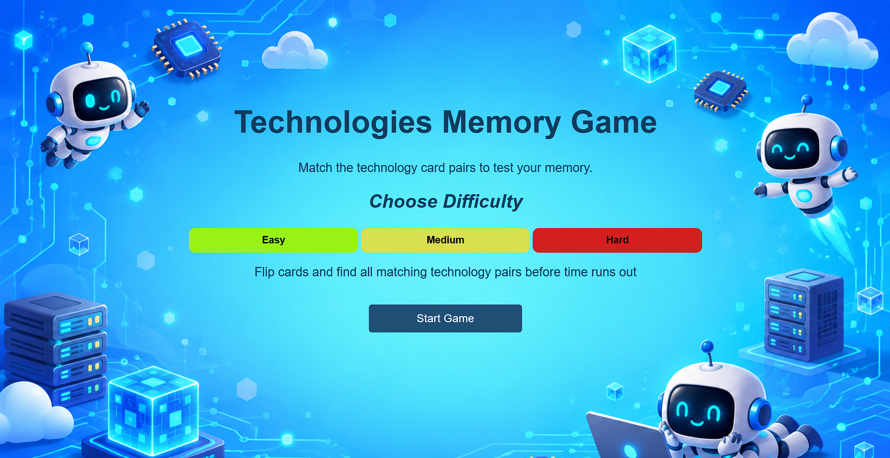
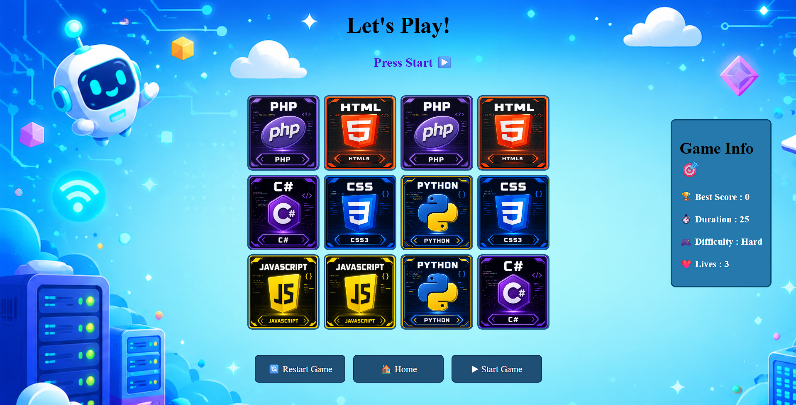

# Technologies Memory Match

## Technologies Used

- HTML
- CSS
- JavaScript
- Local Storage

## Description

Technologies Memory Match is a memory card game based on technology logos.

The game includes technology cards such as HTML, CSS, JavaScript, Python, PHP, and C#.

The player must reveal two cards at a time and find matching technology pairs.

The game includes different difficulty levels, each with a different time limit and number of lives.

The selected difficulty is saved using Local Storage, so the game can remember the player's selected difficulty.

## User Stories

- As a user, I want to choose a difficulty level before starting the game.
- As a user, I want to reveal technology cards.
- As a user, I want to match two cards with the same technology.
- As a user, I want to see my score.
- As a user, I want to see the remaining lives.
- As a user, I want to see the remaining time.
- As a user, I want to receive a message when I make a correct or incorrect match.
- As a user, I want to see a win message when I match all the pairs.
- As a user, I want to see a game-over message when I run out of lives or time.
- As a user, I want to restart the game.
- As a user, I want my selected difficulty to be saved.

## Screenshots

### Home Page

### Game Page

## Future Enhancements

- Add more technology logos.
- Add sound effects for matches and incorrect attempts.
- Add background music.
- Save the highest score using Local Storage.
- Add different game modes.
- Add animations when cards are flipped.
- Add a leaderboard for the best scores.

## Credits

- Technology logos and images used in the game.
- Developed using HTML, CSS, and JavaScript.